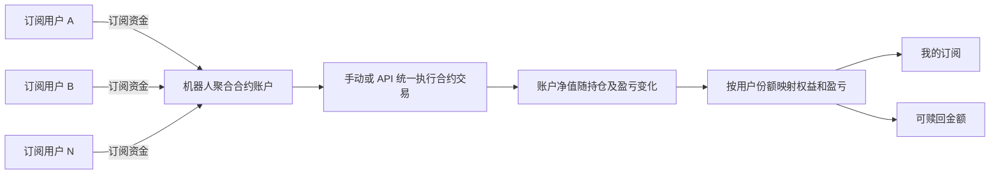
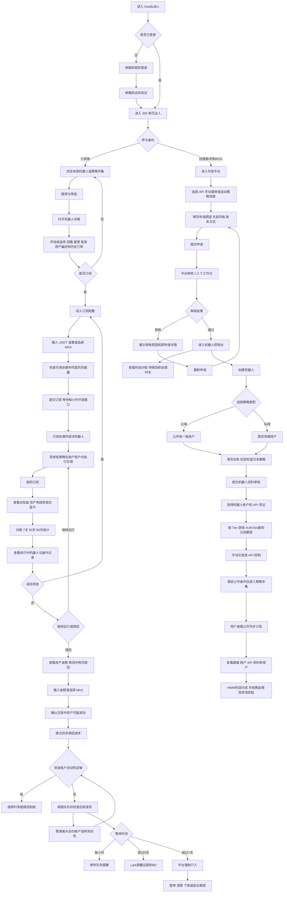

# OneBullEx「300 斯巴达人」功能全景梳理

> 走查环境：OneBullEx Testnet（简体中文）  
> 走查日期：2026-08-12  
> 入口：`/zh-cn/spartans`、`/zh-cn/spartan-openplatform`  
> 教程：`https://support.onebullex.com/hc/zh-tw/articles/5376208077342`  
> 说明：本报告综合页面实际走查及用户提供的内部教程/会议材料；未执行订阅确认、申请提交、充值或交易等会改变账号状态的操作。页面数据会实时变化，Tier 门槛、分润和返佣等运营参数也可能调整。

## 1. 产品定位与参与角色

「300 斯巴达人」是 OneBullEx 的自动化策略机器人平台。用户订阅机器人后，系统按机器人策略在用户的 OneBullEx 账户内自动执行交易；资金不转移给策略创建者。平台明确说明机器人可减少情绪化交易，但不保证盈利。

更准确地说，SPARTANS 是基于统一资金池和份额（Share）的策略交易系统：

- 对策略方（To B）：属于配资型策略管理平台，内部材料描述为可将管理者自有资金最高放大约 20 倍，实际额度受 Tier、AUM 上限及风控约束。
- 对普通用户（To C）：是优质交易策略的公开/私域市场，用户以订阅资金换取机器人资金池份额。
- 用户资金统一进入机器人资金池；每位用户按存入时净值获得对应份额。
- 策略的收益、亏损和费用反映到资金池净值，再按用户持有份额映射个人权益。

核心计算口径：

- 每股净值 = 机器人账户总资产 ÷ 总份额。
- 用户权益 = 用户持有份额 × 当前每股净值。
- 订阅获得份额 = 批次处理时订阅金额 ÷ 当时每股净值。
- 赎回权益 = 批次处理时赎回份额 × 当时每股净值。

平台涉及两条主线：

- 订阅者：发现机器人、评估历史表现、配置订阅、查看运行资产与盈亏。
- 创建者/合作方：申请专属机器人，以 API、手动交易或自动策略控制机器人，并获取利润分成、订阅费分成、邀请返佣及竞技场奖励。

开放平台面向：

- 量化交易机构：通过 API 控制机器人执行交易。
- 跟单交易者：通过手动交易控制机器人执行。
- KOL/合作伙伴：创建策略，由机器人自动执行，并通过邀请关系获得返佣。

### 1.1 与传统跟带单的区别

| 对比项 | 传统跟带单 | SPARTANS 统一资金池 |
|---|---|---|
| 核心机制 | 将管理者交易信号复制到各用户账户 | 所有订阅资金进入同一机器人资金池统一交易 |
| 资金管理 | 用户资金保留在各自跟单账户 | 集中管理，以份额和净值计算权益 |
| 成交结果 | 各账户可能出现滑点、延迟、漏单和成交价差异 | 资金池只执行一套订单，成本和仓位口径统一 |
| 大资金影响 | 大额跟单可能加剧市场冲击并影响其他跟单用户 | 管理者基于整体 AUM 统一规划仓位和风险 |
| 收益亏损 | 按各账户实际成交结果独立计算 | 按资金池份额统一分配 |
| 订阅生效 | 通常即时创建跟单关系，等待下一次开仓 | 每小时批次处理并按当时净值铸造份额 |
| 赎回 | 用户可独立即时退出或设置止盈止损 | 全部平仓时或每小时批次按流动性处理 |
| 用户控制 | 自主性较高，但容易偏离原策略 | 个人操作空间较少，以保持策略完整性 |
| 管理能力 | 管理者难以掌握所有用户真实成交情况 | 管理者可统一掌握资金、成本、持仓和风险敞口 |

主要卖点是统一执行、降低重复下单的交易成本和执行偏差、保持策略完整性，并允许一个管理者通过开放平台同时管理多个不同风险/风格的资金池，更适合规模化策略和专业资产管理场景。

## 2. 信息架构与页面入口

| 模块 | 路径/入口 | 主要用途 |
|---|---|---|
| 斯巴达首页 | `/zh-cn/spartans` | 产品介绍、本周机器人、策略市集、我的订阅、开放平台、FAQ |
| 策略市集 | `/zh-cn/spartans-all` | 全量机器人、搜索、时间周期和指标筛选、分页 |
| 机器人详情 | `/zh-cn/spartan-bot/{机器人名}` | 风险收益指标、策略说明、持仓、历史订单、订阅入口 |
| 我的订阅 | `/zh-cn/spartan-subscriptions` | 组合表现、进行中机器人、盈亏统计、操作记录 |
| 开放平台 | `/zh-cn/spartan-openplatform` | 创建者角色、收益方式、申请流程说明 |
| 开放平台申请/状态 | `/zh-cn/spartan-openplatform-apply` | 首次申请、审核中、拒绝原因、申请详情与重新申请 |
| 机器人控制台 | `/zh-cn/spartan-openplatform-console` | 收益统计、机器人列表、搜索、创建及进入管理详情 |
| 创建机器人 | `/zh-cn/spartan-openplatform-create` | 选择公域/私域，填写机器人资料和策略标签 |
| 后台机器人详情 | `/zh-cn/spartan-openplatform-bot/{内部记录ID}` | 数据、账户、API、机器人信息及订阅用户管理 |
| 机器人公开页面 | `/zh-cn/spartan-bot/{机器人名}` | 面向订阅者的绩效、持仓、订单和订阅页面 |
| 教程 | 页面顶部“教程” | 跳转 OneBullEx 帮助中心教程 |
| 双重订阅福利 | `/zh-cn/activity/spartan-double` | 斯巴达相关营销活动入口 |

## 3. 订阅者侧功能

### 3.1 斯巴达首页

- 主入口提供“策略市集”和登录后的“我的订阅”。
- “本周 SPARTANS”展示精选机器人卡片。
- 卡片字段包括：机器人名称、订阅人数、策略标签、30 天收益率、资产规模、订阅按钮。
- 首页引导用户进入开放平台，强调创建机器人、拓展交易社区和订阅返佣。
- FAQ 说明：无需编程或交易经验即可订阅；资金留在个人账户；可查看资产和交易记录；历史表现不构成盈利保证。

### 3.2 策略市集

- 顶部全局指标：最高 30 日收益率、总资产规模、总订阅人数。
- 列表默认每页显示 12 个机器人，采用 3 列卡片布局；超出部分通过底部分页切换。
- 时间周期筛选位于列表工具栏左侧，支持 7 天、30 天和 90 天，默认 30 天。
- 切换周期后，卡片上的收益率标题与数值应同步切换为对应的 7/30/90 天统计口径。
- 排序工具位于工具栏中部，支持按收益率、资产规模、订阅人数和胜率排序；当前选中的指标高亮显示。
- 策略搜索位于工具栏右侧，支持按机器人/策略名称搜索并缩小当前列表结果。
- 周期、排序、搜索和分页应组合生效；变更周期、排序条件或搜索词后，建议自动回到第 1 页。
- 机器人卡片展示：名称、订阅人数、风险/策略类型、周期收益率、资产规模、订阅操作。
- 策略标签示例：私有策略、积极型、趋势跟随。
- 走查时共 39 条记录、4 页，底部显示当前范围、记录总数和页码。
- 数据标注“每五分钟更新”。
- 页面还提供选择机器人、费用、历史收益风险等 FAQ。

### 3.3 机器人详情

以 `OBE-Jason` 详情页为样本，页面具备：

- 基础状态：机器人名称、“战斗中”等运行状态、风险类型、策略类型。
- 商业信息：订阅人数、分润比例、订阅按钮、分享按钮。
- 时间周期切换：默认 30 天。
- 核心绩效：收益率、最大回撤、单位净值。
- 交易统计：交易量、夏普比率、胜率、盈利次数、总交易次数、平均盈利、平均亏损、盈亏比、每日交易频率、交易天数。
- 机器人概览：资产规模、分润比例，以及收益率/净值/规模趋势图。
- 资产偏好：按币种展示配置占比，例如 BTC 100%。
- 策略描述：创建者填写的策略说明。
- 当前持仓：合约、数量、平均开仓价、交易手续费、资金费、开仓总价值；无仓位时显示“等待信号”。
- 历史订单：方向、合约、保证金模式、杠杆、数量、开平仓价、扣费前盈亏、手续费、资金费、开仓总价值、开平仓时间。
- 隐私处理：历史订单时间的秒级信息被掩码显示。
- 相关推荐：“其他策略”和“查看更多”。

### 3.4 订阅动作

详情页和机器人卡片均有“订阅”入口。点击后打开“确认订阅”弹窗，操作内容包括：

- 机器人摘要：头像、名称、分润比例和 30 天收益率，供用户在付款前再次确认目标策略。
- 订阅账户：输入 USDT 订阅金额，支持 `MAX` 快捷填入。
- 可用余额：实时展示可用于订阅的 USDT；余额旁提供快捷充值入口。
- 风险确认：必须勾选“我已阅读并同意 300 SPARTANS 风险披露”。
- 处理时机：订阅不会立即执行，而是在下一次开放窗口处理；页面说明开放窗口每小时一次。
- 批次定价：系统在每小时批次执行时，以包含未实现盈亏的即时每股净值计算用户获得的份额。
- 资金去向：订阅资金先汇入机器人资金账户，管理者再将可交易资金划转至合约账户。
- 确认按钮：金额有效且风险披露已勾选后方可提交；余额为 0 或未填写金额时保持禁用。

本次没有点击最终“确认”，避免改变测试账号的资金状态。仍建议补测：

- 订阅金额的最小值、最大值和余额校验。
- 订阅费是否为 0，以及活动结束后的收费展示。
- 开放窗口的准确时间、排队状态、取消订阅申请及处理失败后的资金回滚。
- 是否支持止盈/止损、最大投入、自动追加或自动复投。
- 余额不足、KYC/地区限制、机器人停运、满员等异常态。

### 3.5 赎回操作

已订阅用户在机器人公开详情页看到“赎回”按钮。点击后打开赎回弹窗：

- 资金摘要：资产金额、赎回中金额、可赎回金额，币种为 USDT。
- 赎回金额：用户输入本次金额，也可通过 `MAX` 选择全部可赎回资产。
- 可赎回口径：可赎回金额等于当前允许新发起赎回的部分；已经处于赎回中的资金单独列示，避免重复提交。
- 风险提示：机器人可能正在交易，页面明确提示赎回数量会因交易产生波动，应以实际到账/最终处理数量为准。
- 确认提交：填写合法金额后提交赎回请求；本次没有执行最终确认。

赎回按处理时即时每股净值计算，包含未实现盈亏。存在两种触发方式：

- 全部平仓：用户可按持有份额全部赎回。
- 每小时批次：系统检查机器人资金账户流动性，并按队列依次尝试处理。

批次队列规则：

1. 若当前用户的赎回金额小于或等于资金账户可用资金，则完成赎回，并从资金账户扣减相应金额。
2. 若当前用户赎回金额大于资金账户资金，该用户继续排队；系统可以继续检查后续较小金额的赎回请求。
3. 当资金账户不足时，管理者需要从合约账户划转资金到资金账户；API 管理者可使用账户划转接口，手操管理者可手动划转。

因此赎回是异步结算流程而非即时到账。订阅者侧应展示已提交、排队中、处理中、已完成、部分完成、已取消、失败/退回，并同步预计处理时间、最终到账数量和失败原因。

运营超时机制（来源于内部教程，参数可能调整）：

- 队列等待期间，每小时向用户发送一次邮件提醒。
- 等待超过 5 天，每日通过 Lark 提醒运营与 BD 跟进管理者补充流动性。
- 等待超过 7 天进入平台强制介入：可暂停、清算或下架机器人；若持续无法联系管理者，可强平仓位并自动赎回用户资金；有充分理由时可延长期限并每日追踪。

### 3.6 我的订阅

“我的订阅”路径为 `/zh-cn/spartan-subscriptions`，是订阅者管理全部机器人资产与资金操作的中心。

- 用户概览：展示用户昵称/头像及“我的总权益”。
- 资产构成环图：区分账户可用余额与各机器人当前权益，并标注每个机器人贡献的资产金额。
- 组合表现：总运行资产、当前收益率、总盈亏、已实现盈亏、未实现盈亏。
- 统计图表：按时间绘制组合盈亏走势，支持 7 天、30 天和 90 天周期切换，默认 30 天。
- 无数据状态：没有订阅时显示 0 值、空表及“暂无结果”，不能解释为页面功能缺失。

页面下半部分分为两个页签：

#### 进行中

- 列表字段：机器人名称、运行中资产、原订阅金额、当前盈亏、收益率和操作。
- “添加”：对已有机器人追加订阅资金，预计复用订阅金额、余额、风险披露和开放窗口校验。
- “赎回”：进入赎回金额弹窗，支持部分或全部赎回。
- 机器人名称/头像应可进入公开详情页，便于结合当前表现再决定追加或赎回。

#### 操作记录

- 字段：操作类型、金额（USDT）、状态、时间。
- 操作类型至少包括“订阅 {机器人名}”与“从 {机器人名} 赎回”。
- 金额采用资金方向表达：订阅为负数（资金转入机器人），赎回为正数（资金回到账户）。
- 已观察状态包括“成功”和“已取消”；后续还应覆盖排队中、处理中、失败等异步状态。
- 记录按时间展示，可用于核对订阅、追加和赎回是否被开放窗口实际处理。

## 4. 创建者/开放平台功能

### 4.1 开放平台价值说明

- 量化机构：API 控制机器人。
- 跟单交易者：手动交易控制机器人。
- KOL/合作伙伴：策略自动化与邀请返佣。
- 利润分成：获得订阅者交易利润的一部分。
- 订阅费分成：获得订阅费的一部分；页面标注当前活动期暂免订阅费。
- 邀请返佣：被邀请用户订阅并交易时产生返佣。
- 竞技场奖励：表现优秀的机器人有机会获得竞技场奖励。

### 4.2 申请流程

1. 注册 OneBullEx 账户。
2. 提交机构/个人信息及使用场景。
3. 等待审核，页面承诺 1–3 个工作日。
4. 获取 SPARTANS 机器人并开始使用。

实际申请页目前只展示两个必填项：

- 申请原因与交易风格：多行文本。
- 联系方式：邮箱或 Telegram ID。

另有“返回”和“提交申请”按钮。

### 4.3 申请状态与审核结果

申请页同时承担申请状态页的职责，不同账号/审核阶段呈现不同内容：

- 首次申请：展示申请原因与交易风格、联系方式两个必填项，以及“提交申请”。
- 已提交/审核中：应展示申请详情和审核状态，审核目标时效为 1–3 个工作日。
- 审核拒绝：显示“申请已拒绝”、拒绝原因、提交时间、原申请原因与交易风格、原联系方式。
- 拒绝后操作：提供“返回”和“重新申请”；重新申请回到可编辑表单，形成再次审核闭环。
- 审核通过：用户获得开放平台权限，并进入机器人控制台。

审核状态需要区分：未申请、审核中、已通过、已拒绝。拒绝原因由平台侧返回并明确展示，避免只给出笼统失败提示。

### 4.4 机器人控制台

审核通过后进入创建者工作台，主要包括：

- 收益统计：总利润分配、预计下次利润分配、待赎回金额、待处理时长。
- 我的机器人：机器人列表及名称、订阅人数、资产规模、预计利润分配、待赎回/待处理时长。
- 列表能力：按机器人名称搜索；资产规模、利润分配和待赎回字段支持排序。
- 操作入口：“创建机器人”及单个机器人的更多操作/详情入口。
- 空状态：尚未创建机器人时应提供明确引导。

这里的“利润分配”属于机器人创建者收入，“待赎回”及处理倒计时属于结算状态，两者不应与订阅者侧盈亏混淆。

### 4.5 创建机器人

创建页包含以下配置：

- 策略类型：
  - 公域（公开）：开放给一般 OneBullEx 用户，可进入公开策略市集。
  - 私域（私密）：仅限定/受邀用户可见或订阅。
- 机器人名称：必填，只允许英文或数字、不允许空格，最多 25 个字符。
- 策略标签：通过“添加标签”配置，用于公开页和市集的风险/策略分类展示。
- 机器人策略：必填富文本编辑器，支持基础文本格式、列表、链接、图片、表格、代码等内容能力。
- 页面操作：“返回”和提交创建申请。

页面按钮文案显示“提交申请”，说明创建机器人后可能仍需机器人信息审核，而不是立即公开。建议状态模型区分：草稿、待审核、审核通过、审核拒绝、运行中、已暂停/下架。

### 4.6 后台机器人详情

每个机器人有独立后台详情页。页头展示内部 BOT ID、名称、运行状态，并可跳转“机器人公开页面”。管理区分为五个页签：

#### 数据

- 订阅人数、净资产价值（USDT）、30 日 ROI、胜率、交易天数和交易量。
- FAQ 明确数据口径：管理资产规模基于订阅用户跟单账户净资产价值实时计算，包含盈亏波动；30 日 ROI 为最近 30 个自然日投资回报率。
- 利润分成采用 HWM（历史最高净值）机制，按 UTC+0 结算；只有净值创新高且存在已实现利润时才触发可分配利润。
- 进入 SPARTANS 公开列表的条件：交易天数大于 3 天且管理资产规模大于 1,000（以页面当前规则为准）。

#### 账户

- 展示机器人 UID、虚拟登录邮箱及“获取密码”。
- 机器人账号支持 Web 与 App 登录，可用于手动交易。
- 机器人账号是受限交易账户：登录后产品导航仅保留“合约”，不开放普通用户账户中的现货等其他交易产品。
- 合约页面仍提供行情图、盘口、开仓/平仓、杠杆、委托、止盈止损、当前持仓、历史仓位/委托/成交、资金流水及账户总览等完整合约交易能力。
- 账户资产不是机器人创建者的个人充值资产，而是所有订阅用户分配给该机器人的订阅资金聚合值，并随统一交易产生的已实现/未实现盈亏波动。
- 机器人以聚合账户统一开仓和平仓；订阅者侧再按各自份额映射运行资产、盈亏与可赎回金额。
- 首次获取密码需要使用主账号绑定邮箱完成验证码验证；站方说明不保存机器人密码，忘记后可重新获取/重置。
- 安全设置支持绑定身份验证器应用，用于登录及敏感设置确认。
- 报告只记录能力，不记录机器人 UID、虚拟邮箱或密码等敏感内容。

#### 资金聚合与跟单模型

该模型下需明确区分：

- 订阅总额：用户累计转入机器人的本金口径。
- 机器人账户余额/钱包余额：扣除已用保证金后的可用资金口径。
- 账户权益/净资产：余额加未实现盈亏等实时权益口径。
- 管理资产规模：所有订阅用户对应的机器人净资产汇总，包含交易盈亏波动。
- 用户运行中资产：聚合账户净值按该用户份额映射后的权益，不一定等于原订阅金额。

因此，“所有订阅用户订阅总额”是机器人账户的资金来源；页面展示的实时账户权益会进一步受到持仓盈亏、手续费、资金费及已处理订阅/赎回的影响，不应始终与历史累计订阅金额机械相等。

#### API

- API Key 与 Secret Key 默认掩码展示。
- 支持显示/隐藏及复制凭证。
- 提供 API 文档入口，包括快速入门、API 参考和多语言代码示例，用于通过 API 控制机器人交易。
- API 凭证属于高敏感信息，应在显示、复制、重置等操作前做二次验证，并提供轮换和吊销能力。

#### 机器人信息

- 展示机器人资料审核状态，例如“审核通过”。
- 培训文档说明当前暂不支持管理者直接修改；页面即使展示名称、标签和策略介绍字段，也应按审核状态控制可编辑权限。
- 这些资料与公开页面直接关联；若未来开放修改，应重新进入资料审核，避免未经审核的内容直接对外发布。

#### 用户

- 查询订阅用户，字段包括 UID、脱敏用户标识、订阅金额、盈亏和订阅时间。
- 邮箱在界面上做部分脱敏；创建者可了解资金和业绩，但不应获得完整用户隐私信息。
- 私域机器人额外提供白名单配置：可输入用户 UID，也可套用合伙人关系；只有命中白名单的用户才能订阅。

### 4.7 管理者等级（Tier）机制

培训文档定义五级管理者体系；以下为 2026-08-12 培训材料参数，属于运营配置，不应在代码或文案中永久写死：

| 条件/权益 | Tier 1 FIRST BLOOD | Tier 2 PROVEN IN BATTLE | Tier 3 ELITE GUARD | Tier 4 UNDYING FORCE | Tier 5 ETERNAL GLORY |
|---|---:|---:|---:|---:|---:|
| 管理者自有资金 | 100 | 1,000 | 10,000 | 50,000 | 150,000 |
| 30d ROI | 无要求 | >= 0 | >= 0 | >= 0 | >= 0 |
| 30d MDD | 无要求 | 无要求 | <= 50% | <= 40% | <= 30% |
| 30d 平均赎回时效 | <= 5 天 | <= 4 天 | <= 3 天 | <= 3 天 | <= 3 天 |
| 30d 交易量 | 无限制 | >= 100,000 | >= 500,000 | >= 2,000,000 | >= 5,000,000 |
| AUM 上限 | 2,000 | 20,000 | 200,000 | 1,000,000 | 3,000,000 |
| 分润周期 | 月 | 月 | 周 | 周 | 周 |
| Bot Limit | 1 | 2 | 3 | 4 | 5 |
| Profit Sharing | 10% | 12% | 15% | 17% | 20% |
| 专人产研支持 | - | - | - | - | 有 |

所有等级还需满足“无违规”硬性条件。评级节奏：投入自有资金时即时判断、每日 UTC+0 判断升级；每周一 UTC+0 且分润结束后判断降级。

培训材料另给出分润拆分口径：总分润中管理者获得 90%，平台使用费为 10%；例如 Tier 1 总分润 10% 可拆为管理者 9% 和平台 1%。该拆分是否在所有市场/活动下统一适用，需要以结算配置为准。

### 4.8 分润机制

分润采用“每笔平仓即时判断 + 周/月发放周期”的 HWM 高水位逻辑：

1. 每笔平仓时，判断即时净值（含未实现盈亏）是否高于此前分润时的 HWM。
2. 判断累计已实现盈亏（含本次平仓）是否大于未实现亏损。
3. 两项同时满足时：
   - 可分润金额 = 累计已实现盈亏 - 未实现亏损。
   - 实际分润 = 可分润金额 × 当前 Tier 分润比例，并即时划转到官方分润账户。
   - 累计已实现盈亏扣减本次可分润金额，剩余部分继续累计。
4. 不满足时不分润，累计已实现盈亏继续保留计算。

此机制避免只看已平仓盈利而忽略尚未平仓的浮亏。后台规划还包括分润明细，至少应披露计算周期、HWM、累计已实现盈亏、未实现亏损、可分润金额、比例、管理者所得、平台费用与发放状态。

### 4.9 返佣机制

返佣来自机器人交易手续费的二次拆分：

- 机器人账户每笔成交时，按订阅用户是否存在推荐/合伙人关系判断归属。
- 存在关系时：返佣金额 = 该笔手续费 ×（该订阅用户持有份额 ÷ 总份额）× 返佣比例。
- 培训文档记录默认返佣比例为 20%，可调整；案例中的 60% 属于特定配置，不应视为全局默认值。
- 推荐/合伙人返佣每日结算一次。

### 4.10 Web 与 App 覆盖

- 用户侧已覆盖 Web 与 App：入口、策略市集、机器人详情、订阅、我的订阅、赎回和操作记录。
- App 详情页同样展示收益/风险指标、资产偏好、持仓和历史订单等核心信息。
- 开放平台当前尚未原生化，管理者申请、创建机器人、账户/API/用户管理等以 Web 为主。
- 需要明确 App 中打开开放平台时采用 H5、外部浏览器还是暂不提供入口，并保持用户侧 Web/App 数据口径一致。

### 4.11 后台与公开页映射

后台详情中的“机器人公开页面”跳转到 `/zh-cn/spartan-bot/{机器人名}`。两侧信息关系如下：

| 创建者后台 | 订阅者公开页 |
|---|---|
| 名称、策略标签、策略介绍 | 机器人标题、标签、策略描述 |
| 订阅人数、资产规模、ROI、胜率 | 订阅人数、资产规模、收益率、胜率等表现指标 |
| 机器人运行状态 | “战斗中”等公开状态 |
| API/手动账户产生的交易 | 当前持仓与历史订单 |
| 公域/私域配置及公开条件 | 是否进入策略市集、是否仅限指定用户 |
| 分润设置/结算 | 公开页分润比例与订阅者收益分配 |

公开页还展示时间周期、收益率曲线、单位净值、最大回撤、夏普比率、盈亏统计、资产偏好、当前持仓、历史订单、分享与订阅入口。

## 5. 端到端流程图

## 6. 状态与异常细节

- 登录采用邮箱 + 密码，并可能触发邮箱验证码二次验证。
- 未登录时首页隐藏“我的订阅”；登录后显示。
- 空订阅账户有明确的 0 值、空图表和空操作记录状态。
- 订阅金额、可用余额和风险披露共同控制订阅确认按钮是否可用。
- 订阅按下一次每小时开放窗口处理，提交成功不等于机器人立即启动。
- 赎回中资金与可赎回资金分开展示；机器人交易期间金额可能波动。
- 赎回属于异步处理，创建者控制台会汇总待赎回金额和待处理时长。
- 机器人虚拟账户仅开放合约交易；所有订阅资金聚合后由该账户统一执行交易。
- 机器人账户权益会随合约持仓盈亏、费用及订阅/赎回变化，再按份额映射到订阅者。
- 机器人无当前持仓时显示“等待信号”。
- 私有策略仍展示收益率、资产规模等摘要，但策略标签为“私有策略”。
- 市集和详情数据存在实时变化，首页与市集在短时间内可能出现轻微数值差异。
- 走查期间曾遇到页面 `Failed to fetch`/加载不稳定；应提供局部重试、错误说明和骨架屏，避免整页无反馈。
- 申请页同时承担表单和审核状态展示；拒绝后可查看原因并重新申请。
- 开放平台控制台仅对审核通过的账号开放，应在路由和接口层同时鉴权。
- 公域机器人需满足交易天数与资产规模门槛后才进入公开列表；创建成功不等于立即在市集曝光。
- API Key、Secret Key、机器人密码、机器人虚拟邮箱属于敏感资产，展示、复制、获取及重置均需严格审计与二次验证。
- 培训材料说明订阅费分成尚未启用；页面上的相关宣传应避免让用户误认为当前已有实际收入。
- 机器人信息当前不支持管理者直接修改；未来开放编辑时需配套重新审核。
- 私域机器人只允许 UID/合伙人白名单用户订阅，白名单接口需防止越权批量枚举用户。
- Tier 参数、分润比例和返佣比例属于运营配置，报告记录的是培训材料当前版本，不代表长期固定规则。
- 某些页面的顶部导航一度显示“登录/注册”，但页面主体仍能读取登录账号数据，疑似认证状态渲染不同步，建议专项排查。

## 7. 建议补测清单

- 完整订阅闭环：配置、协议、扣款、启动、通知、失败回滚。
- 订阅窗口：整点边界、重复提交、窗口前取消、余额占用及失败后的资金释放。
- 停止/赎回闭环：部分/全部赎回、在途仓位处理、金额波动、最终到账、处理时长和费用。
- 创建者后台：创建后的审核、编辑重审、暂停、发布/下架、删除及机器人异常状态。
- 申请状态：审核中、通过、拒绝、重新申请、重复提交和权限失效。
- 机器人账户：获取/重置密码、验证码、身份验证器绑定及主账号与机器人账号权限隔离。
- 聚合资金：订阅总额、钱包余额、账户权益、管理资产规模和用户份额之间的实时对账。
- 交易权限：仅合约的前端入口限制与后端接口权限必须一致，禁止通过直链/API 越权访问现货等产品。
- API 安全：凭证查看、复制、轮换、吊销、IP 白名单、权限范围与操作审计。
- 收益结算：HWM、UTC+0 周期、预计分配、待赎回和异常结算的口径一致性。
- Tier 评级：升级/降级边界、无违规硬条件、AUM 超限、Bot Limit 超限和降级后的存量处理。
- 分润明细：HWM、已实现/未实现盈亏、管理者所得、平台费、周/月发放与冲正记录。
- 返佣对账：份额占比、合伙人关系生效时间、比例调整、每日结算及重复/漏发检查。
- 私域权限：UID 白名单、合伙人关系同步、移出白名单后的存量订阅及隐私保护。
- 权限与合规：KYC、地区限制、风险测评、二次确认。
- 数据口径：收益率、净值、回撤、盈亏、资金费和手续费的计算方式。
- 实时性：五分钟更新是否覆盖所有字段，持仓/订单是否采用更高频更新。
- 异常恢复：接口失败、行情中断、机器人停机、策略撤回、账户余额不足。
- 多端一致性：Web、App 和不同语言版本的字段、状态和操作一致。

## 8. 资料依据与使用边界

- 一级依据：`斯巴达培训文档.pdf`（21 页，生成时间 2026-08-12），用于统一资金池、订阅赎回、Tier、分润、返佣和运营风控规则。
- 二级依据：OneBullEx Testnet 简体中文页面实际走查，用于确认当前页面、字段、按钮、状态和路由。
- 补充依据：用户提供的 Web/App 截图，用于确认不同账号状态、弹窗、操作记录和移动端表现。
- 教程链接：`https://support.onebullex.com/hc/zh-tw/articles/5376208077342`。本次自动访问未成功，因此未将其作为独立于 PDF 的二次验证来源。

培训文档包含当前运营参数和规划项。以下内容需要上线前再次向产品/运营确认：Tier 门槛、返佣默认值、订阅费分成启用状态、超时通知频率、强制介入时限、机器人信息编辑能力及 App 开放平台原生化进度。
